# 🎨금융팔레트 FinancePalette
금융감독원에 등록된 140여 개 금융 기관의 모든 금융 상품을 비교!  
국내 제1·2금융권이 판매 중인 1,300개 이상의 다양한 금융 상품을 비교해서 보여줌으로써, 사용자의 더 나은 금융 결정을 도와드립니다.
<!-- 사용자의 연령대, 목표 및 선호도 등을 고려하여 최적의 금융 상품을 추천함으로써 더 나은 금융 결정을 도와드립니다. -->

- **개발 기간** : 2023.12. ~ 2023.12. (4주)
- **플랫폼** : Android
- **개발 인원** : 2명

 
  

## 🔴 팀원 소개

 
<table>
  <tr> <th>이름</th> <th colspan="2">역할</th> <th>담당 업무</th> </tr>
  <tr> <td rowspan="4"><a href="https://github.com/gyudol" target="_blank">김규찬</a></td> <td rowspan="4">팀장</td> <td colSpan="2"><strong>프로젝트 기획 및 관리</strong></td> </tr>
  <tr> <td><strong>Backend 100%</strong></td> <td>Apache 서버·DB 설계 및 구축, 데이터 정제·분석·가공,  사전 조사 도메인, 상품 도메인 (필터링, 상세 조회) × 6, AAID 도메인,  
    북마크 도메인, 조회 기록 도메인</td> </tr>
  <tr> <td><strong>Frontend 80%</strong></td> <td>상품 리스트 페이지 × 6, 상품 상세 페이지 × 6, 북마크 리스트 화면,  최근 조회 기록 화면</td> </tr>
  <tr> <td><strong>Design 10%</strong></td> <td>북마크 리스트 화면, 최근 조회 기록 화면</td> </tr>
  <tr> <td rowspan="2">김보민</td> <td rowspan="2">팀원</td> <td><strong>Design 90%</strong></td> <td>홈 화면, 메뉴 화면, 마이 페이지, 사전 조사 화면, 로고 이미지, 
    상품 리스트 페이지 × 6, 상품 상세 페이지 × 6</td> </tr>
  <tr> <td><strong>Frontend 20%</strong></td> <td>홈 화면, 메뉴 화면, 마이 페이지, 사전 조사 화면</td> </tr>
</table>

## 🟠 기술 스택

 

  

  

  

- **Language |** Java 8 (Java 1.8), XML, PHP 8.2.12  
- **Server |** Apache 2.4.58  
- **Library |** 'mysql-connector-j-8.2.0', 'com.google.android.gms:play-services-ads-identifier:18.0.1'  
- **DB |** MySQL 8.0.15  
- **IDE |** Android Studio Giraffe 2022.3.1 Patch 2, IntelliJ IDEA 2022.2.2 Community Edition, phpMyAdmin 5.2.1  
- **API |** 금융감독원 Open API (금융회사개요 API, 정기예금상품 API, 적금상품 API, 연금저축상품 API, 주택담보대출상품 API, 전세자금대출상품 API, 개인신용대출상품 API)   
- **Gradle Version |** Gradle 8.0  
- **SDK Version |**  compileSdk = 34, minSdk = 24, targetSdk = 33

<!-- ## 🟡 시스템 아키텍처 -->

## 🟢 화면 구성

 
<table>
  <tbody align="center"> 
    <tr> <th> 홈 화면 </th> <th> 메뉴 화면 </th> <th> 마이 페이지 </th> <th> 사전 조사 화면 </th> </tr>
    <tr>  <td width="25%">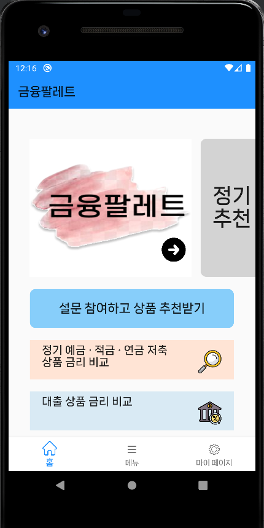</td> <td width="25%">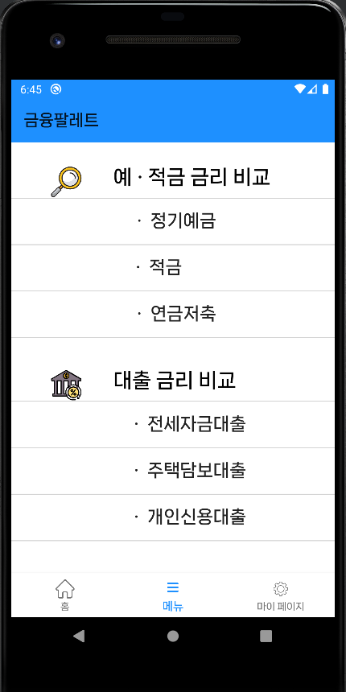</td> 
      <td width="25%"></td> <td width="25%">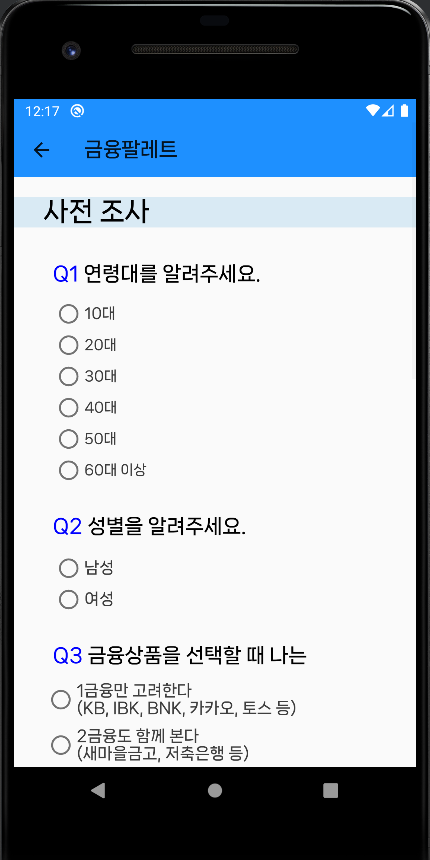</td> </tr>
    <tr> <th> 북마크 리스트 화면 </th> <th> 최근 조회 기록 화면 </th> <th> 정기예금 상품 리스트 페이지 </th> <th> 적금 상품 리스트 페이지 </th> </tr>
    <tr> <td width="25%">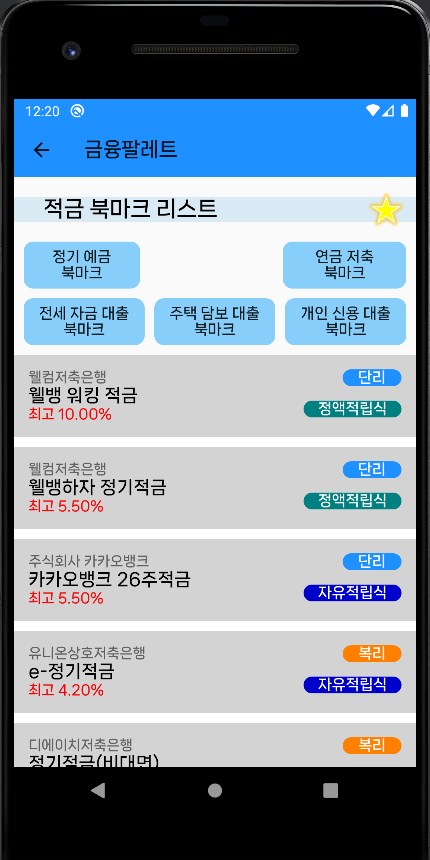</td> <td width="25%"></td>
      <td width="25%">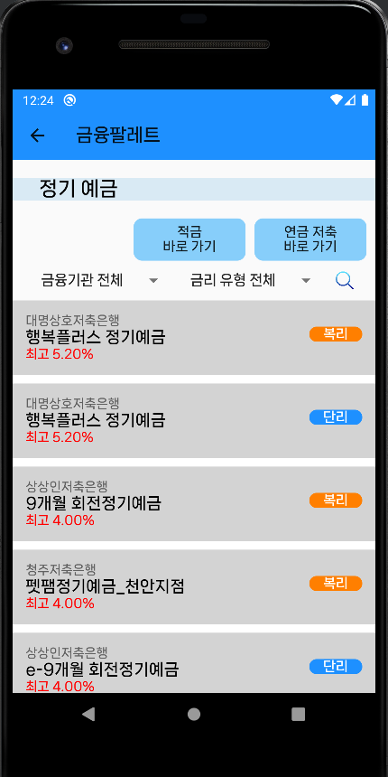</td> <td width="25%">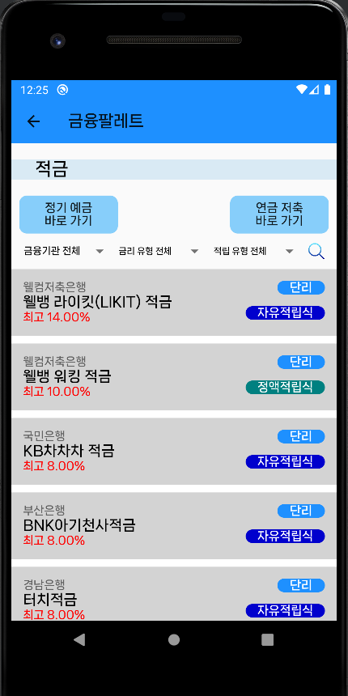</td> </tr>
    <tr> <th> 연금저축 상품 리스트 페이지 </th> <th> 전세자금대출 상품 리스트 페이지 </th> <th> 주택담보대출 상품 리스트 페이지 </th> <th> 개인신용대출 상품 리스트 페이지 </th> </tr>
    <tr>  <td width="25%"></td> 
      <td width="25%"></td> 
      <td width="25%">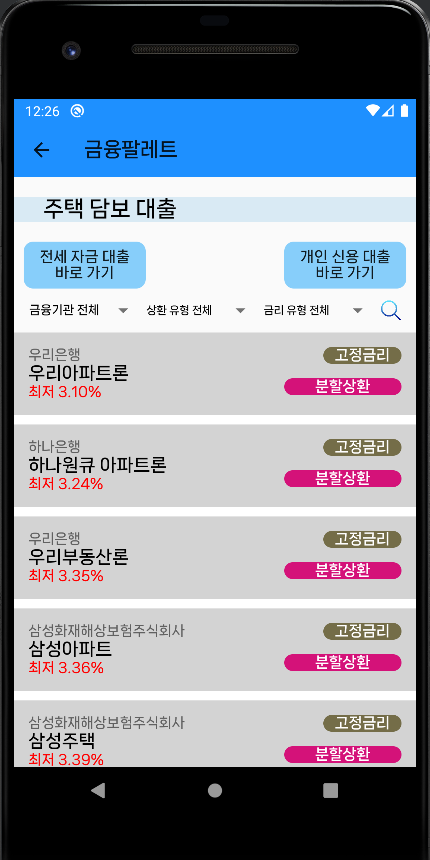</td> 
      <td width="25%"></td> </tr>
    <tr> <th> 정기예금 상품 상세 페이지 </th> <th> 적금 상품 상세 페이지 </th> <th> 연금저축 상품 상세 페이지 </th> <th> 전세자금대출 상품 상세 페이지 </th> </tr>
    <tr>  <td width="25%">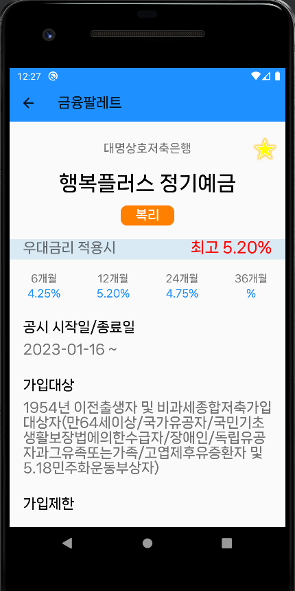</td> <td width="25%">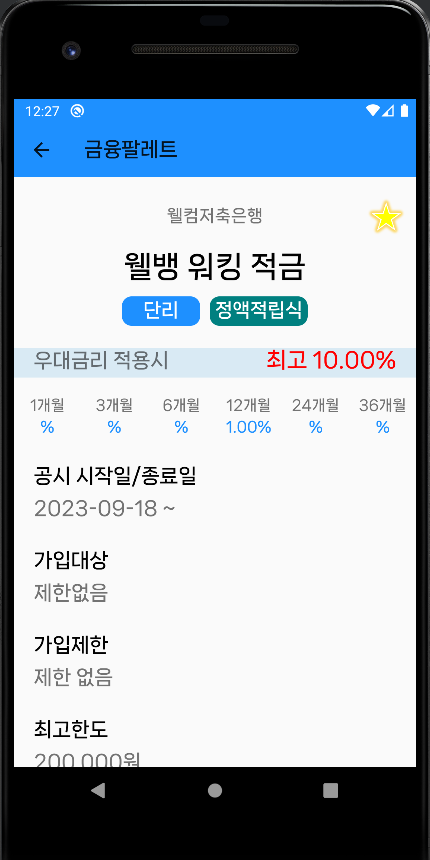</td> 
      <td width="25%">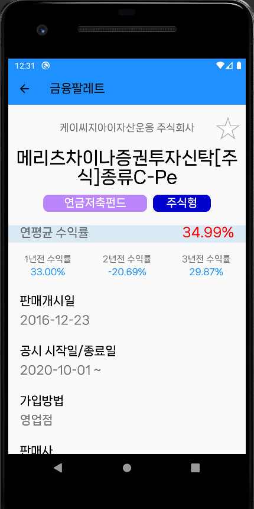</td> 
      <td width="25%"></td> </tr>
    <tr> <th> 주택담보대출 상품 상세 페이지 </th> <th> 개인신용대출 상품 상세 페이지 </th> <th></th> <th></th> </tr>
    <tr> <td width="25%">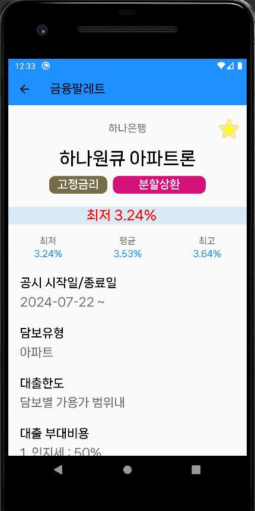</td> 
      <td width="25%">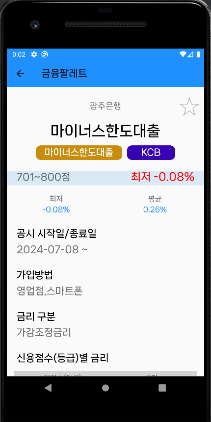</td> </tr>
  </tbody>
</table>

## 🔵 기능 소개
- 먼저, 홈 화면에서 기기로부터 Google Advertising ID를 받아와 사용자를 식별

<h3>상품 조회 및 필터링</h3>

- 상품 데이터 분석을 통해 데이터를 분류하여 **사용자가 원하는 정보를 직접 필터링할 수 있도록** 구성  
- 정기예금 및 적금 상품은 **최고 우대금리 기준 내림차순**으로, 연금저축 상품은 **연평균 수익률 기준 내림차순**으로, 대출 상품은 **최저 대출금리 기준 오름차순**으로 배치  
- 사용자가 상품 상세 페이지를 확인한 후 다시 상품 리스트 화면으로 돌아왔을 때, 이전에 설정한 필터가 유지되어 화면에 보여지며, 리스트의 스크롤 위치를 방금 조회한 상품에 배치하여 **사용자 편의성을 향상**

 
<table>
  <tbody align="center"> 
    <tr> <th> 정기예금 상품 </th> <th> 적금 상품 </th> <th> 연금저축 상품 </th> </tr>
    <tr> <td width="33%">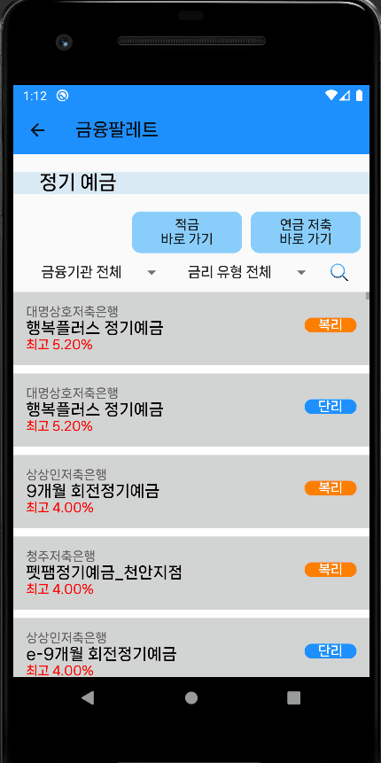</td> <td width="33%"></td> 
      <td width="33%"></td> </tr>
    <tr> <th> 전세자금대출 상품 </th> <th> 주택담보대출 상품 </th> <th> 개인신용대출 상품 </th> </tr>
    <tr> <td width="33%"></td> <td width="33%"></td> 
      <td width="33%"></td> </tr>
  </tbody>
</table>

 
<h3>북마크 기능 및 조회 기록 기능</h3>

- 상품 상세 페이지 우상단의 별 아이콘을 클릭하여 북마크를 등록 및 해제
- 북마크 리스트 페이지는 북마크된 상품이 하나도 없으면 접근할 수 없도록 설정
- 북마크 리스트 페이지는 접속 시 북마크가 가장 많은 종류의 상품 리스트를, 최근 조회 기록 페이지는 조회 기록이 가장 많은 종류의 상품 리스트를 우선적으로 표시하도록 구성
- 조회 기록 데이터는 사용자가 상품 상세 페이지에 접근할 때 추가되거나 수정되며, 조회 기록 페이지에서 사용자의 조회 시간 기준 내림차순으로 배치
- 최근 조회 기록은 종류별로 최대 50개의 상품만 보관하며, 50개를 초과할 경우 가장 오래된 조회 기록을 삭제

 
<table>
  <tbody align="center"> 
    <tr> <th> 북마크 기능 </th> <th> 조회 기록 기능 </th> <th></th> </tr>
    <tr> <td width="33%"></td> <td width="33%">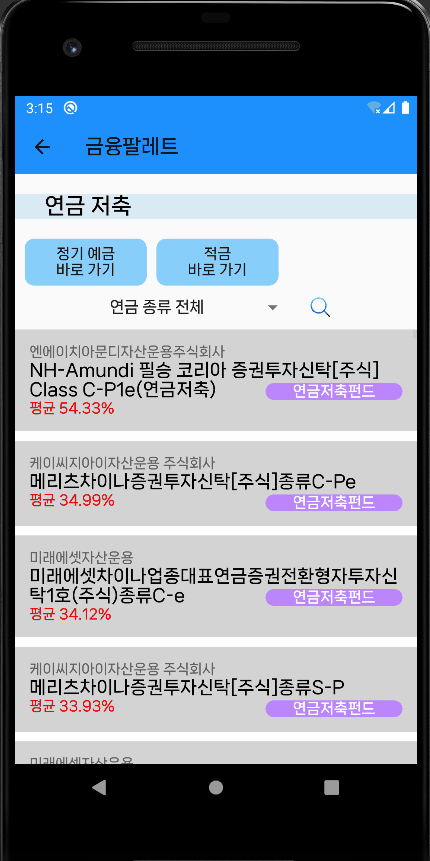</td> </tr>
  </tbody>
</table>

## 🟣 프로젝트 산출물
- <h3>ERD</h3>

  
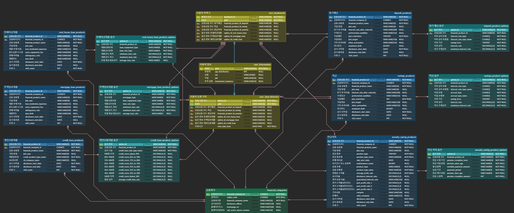

